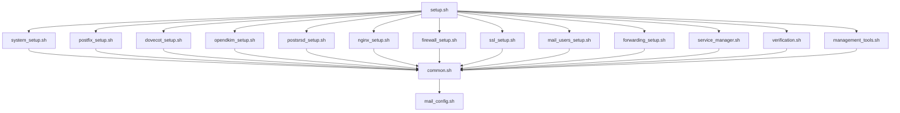

# Modular Mail Server v7.0 - Project Structure

## Overview
This is a complete refactor of the original monolithic mail server setup script, now organized into modular, lightweight, and maintainable components.

## Directory Structure

```
/opt/mailserver/
├── setup.sh                    # Main orchestration script
├── config/
│   ├── mail_config.sh          # Central configuration file
│   └── templates/              # Configuration templates
├── lib/
│   └── common.sh               # Shared functions library
├── modules/
│   ├── system_setup.sh         # System preparation & packages
│   ├── postfix_setup.sh        # Postfix configuration
│   ├── dovecot_setup.sh        # Dovecot configuration
│   ├── opendkim_setup.sh       # DKIM signing setup
│   ├── postsrsd_setup.sh       # Email forwarding setup
│   ├── nginx_setup.sh          # Autodiscovery setup
│   ├── firewall_setup.sh       # UFW firewall setup
│   ├── ssl_setup.sh            # SSL certificate management
│   ├── mail_users_setup.sh     # User management
│   ├── forwarding_setup.sh     # Email forwarding config
│   ├── service_manager.sh      # Service control
│   ├── verification.sh         # Testing & verification
│   └── management_tools.sh     # Tool creation
├── bin/                        # Management tools
│   ├── mail-status             # Status checker
│   ├── mail-test               # Functionality tester
│   ├── mail-user               # User management
│   ├── mail-forward            # Forwarding management
│   ├── mail-ssl                # SSL management
│   ├── mail-restart            # Service restart
│   ├── dkim-test               # DKIM testing
│   └── fix-ports               # Port fixing
├── logs/                       # Log files
└── backups/                    # Configuration backups
```

## Key Improvements

### 1. **Modular Architecture**
- Each service has its own dedicated module
- No code duplication between modules
- Easy to maintain and extend
- Can run modules independently

### 2. **Centralized Configuration**
- All settings in `config/mail_config.sh`
- No hardcoded values in modules
- Easy to customize for different environments

### 3. **Shared Functions Library**
- Common functions in `lib/common.sh`
- Consistent logging and error handling
- Reusable utility functions

### 4. **Management Tools**
- User-friendly command-line tools
- Intuitive commands like `mail-status`, `mail-test`
- Self-contained tools for specific tasks

### 5. **Comprehensive Testing**
- Built-in verification module
- Port connectivity testing
- Service health checks
- Configuration validation

## Quick Start

### Method 1: Manual Setup
```bash
# 1. Download and extract files to /opt/mailserver/
# 2. Edit configuration
nano /opt/mailserver/config/mail_config.sh

# 3. Run setup
sudo /opt/mailserver/setup.sh
```

### Method 2: Quick Install (if hosted)
```bash
curl -fsSL https://your-domain.com/quick-setup.sh | sudo bash
```

## Configuration

Edit `/opt/mailserver/config/mail_config.sh`:

```bash
# Domain settings
DOMAIN="your-domain.com"
HOSTNAME="smtp.your-domain.com"
SERVER_IP=""  # Auto-detected if empty

# Email forwarding
MEMBER_EMAILS="user1@gmail.com,user2@yahoo.com"

# Default users (email:password format)
MAIL_USERS=(
    "admin@your-domain.com:SecurePassword123!"
    "info@your-domain.com:InfoPassword123!"
)
```

## Module Dependencies



## Management Commands

After installation, these commands are available system-wide:

### Core Commands
- `mail-status` - Show comprehensive server status
- `mail-test` - Run full functionality test
- `mail-restart` - Restart all mail services

### User Management
- `mail-user add user@domain.com password123` - Add new user
- `mail-user list` - List all users
- `mail-user remove user@domain.com` - Remove user
- `mail-user change-password user@domain.com newpass` - Change password

### Email Forwarding
- `mail-forward add source@domain.com dest@external.com` - Add forwarding
- `mail-forward list` - List forwarding rules
- `mail-forward remove source@domain.com` - Remove forwarding
- `mail-forward test` - Test forwarding configuration

### SSL Management
- `mail-ssl obtain` - Get Let's Encrypt certificates
- `mail-ssl status` - Check certificate status
- `mail-ssl renew` - Manually renew certificates

### Troubleshooting
- `dkim-test` - Test DKIM configuration
- `fix-ports` - Fix inactive ports

## Module Details

### system_setup.sh
**Purpose**: System preparation and package installation
**Functions**:
- Install required packages
- Create system users and groups
- Set up directory permissions
- Configure hostname and hosts file

**Key Features**:
- Non-interactive package installation
- Proper user/group creation with correct IDs
- Directory structure with correct permissions

### postfix_setup.sh
**Purpose**: Postfix SMTP server configuration
**Functions**:
- Configure main.cf with all required settings
- Set up master.cf with submission ports (587, 465)
- Create transport and virtual maps
- Configure DKIM milter integration

**Key Features**:
- Submission ports properly configured
- SASL authentication for SMTP
- Virtual domains and mailboxes
- SRS integration for forwarding

### dovecot_setup.sh
**Purpose**: IMAP/POP3 server configuration
**Functions**:
- Configure IMAP and POP3 services
- Set up LMTP for local delivery
- Configure authentication service for Postfix
- Set up SSL and namespace configuration

**Key Features**:
- Both IMAP and POP3 with SSL/TLS
- LMTP integration with Postfix
- Authentication backend for SMTP

### opendkim_setup.sh
**Purpose**: DKIM email signing
**Functions**:
- Generate DKIM keys
- Configure OpenDKIM service
- Set up signing tables and key tables
- Create systemd service configuration

**Key Features**:
- 2048-bit RSA keys
- Comprehensive signing configuration
- Proper milter integration

### service_manager.sh
**Purpose**: Centralized service management
**Functions**:
- Start/stop/restart all services
- Port verification and fixing
- Service health monitoring
- Dependency-aware service ordering

**Key Features**:
- Proper service startup order
- Port verification with auto-fix
- Service health checks

### verification.sh
**Purpose**: Comprehensive testing and verification
**Functions**:
- Service status verification
- Port connectivity testing
- Configuration validation
- Feature testing (DKIM, forwarding, etc.)

**Key Features**:
- Complete system health check
- Detailed diagnostic information
- Troubleshooting suggestions

## Configuration Templates

The system uses configuration templates for consistent setup:

### Postfix main.cf Template
- Virtual domains and mailboxes
- SASL authentication
- TLS configuration
- DKIM milter integration
- Security restrictions

### Dovecot Configuration Template
- IMAP/POP3 services
- Authentication configuration
- LMTP service
- SSL configuration
- Namespace setup

### OpenDKIM Configuration Template
- Domain-specific signing
- Key table configuration
- Trusted hosts
- Milter settings

## Error Handling and Logging

### Logging System
- Centralized logging to `/opt/mailserver/logs/`
- Timestamped log entries
- Different log levels (INFO, WARNING, ERROR, SUCCESS)
- Service-specific log sections

### Error Handling
- Configuration validation before applying changes
- Rollback capability with configuration backups
- Graceful error recovery
- Detailed error messages with solutions

### Backup System
- Automatic configuration backups before changes
- Timestamped backup files
- Easy restoration process

## Security Features

### Firewall Configuration
- UFW with minimal required ports
- Automatic rule creation
- Port-specific descriptions
- Security-first approach

### SSL/TLS Configuration
- Let's Encrypt integration
- Automatic certificate renewal
- Strong cipher suites
- TLS 1.2+ enforcement

### Authentication Security
- SASL authentication required
- Encrypted password storage
- Connection encryption enforcement
- Rate limiting protection

## Monitoring and Maintenance

### Health Checks
- Service status monitoring
- Port availability checks
- Configuration validation
- Performance monitoring

### Maintenance Tasks
- Automatic SSL renewal
- Log rotation
- Configuration cleanup
- Security updates

### Troubleshooting Tools
- Diagnostic commands
- Log analysis tools
- Configuration validators
- Performance analyzers

## Migration from Monolithic Version

To migrate from the original monolithic script:

1. **Backup Current System**
   ```bash
   cp /etc/postfix/main.cf /root/postfix-main.cf.backup
   cp /etc/dovecot/dovecot.conf /root/dovecot.conf.backup
   ```

2. **Install Modular Version**
   ```bash
   curl -fsSL https://your-domain.com/quick-setup.sh | sudo bash
   ```

3. **Migrate Configuration**
   - Update `/opt/mailserver/config/mail_config.sh` with your settings
   - Run verification to ensure compatibility

4. **Test Functionality**
   ```bash
   mail-test
   ```

## Customization

### Adding New Services
1. Create new module in `modules/`
2. Add to service list in `mail_config.sh`
3. Update `service_manager.sh` if needed
4. Add verification steps to `verification.sh`

### Custom Configuration
1. Edit templates in `config/templates/`
2. Modify module setup functions
3. Update verification checks

### Additional Tools
1. Create new tools in management_tools.sh
2. Add to bin/ directory during setup
3. Document in help systems

## Support and Troubleshooting

### Common Issues
- **Port not active**: Run `fix-ports`
- **Service not starting**: Check `journalctl -u <service>`
- **Authentication failing**: Verify user database
- **DKIM not working**: Run `dkim-test`

### Getting Help
- Run `mail-test` for comprehensive diagnosis
- Check logs in `/opt/mailserver/logs/`
- Use individual test tools for specific issues

### Performance Optimization
- Monitor with `mail-status`
- Adjust rate limits in configuration
- Monitor system resources
- Regular maintenance tasks

This modular approach provides a maintainable, scalable, and user-friendly mail server setup that eliminates the issues of the original monolithic script while providing enhanced functionality and easier troubleshooting.